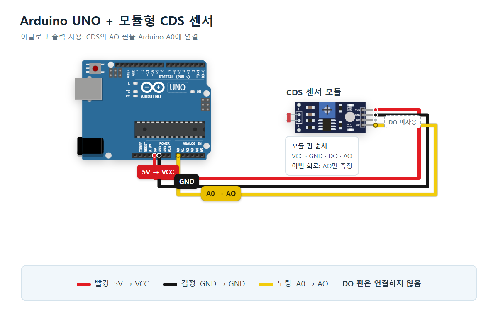
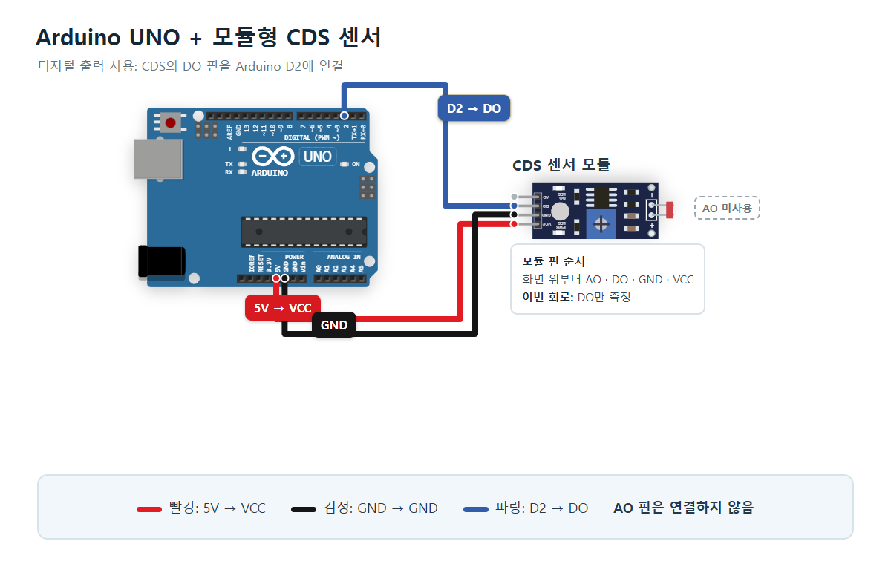
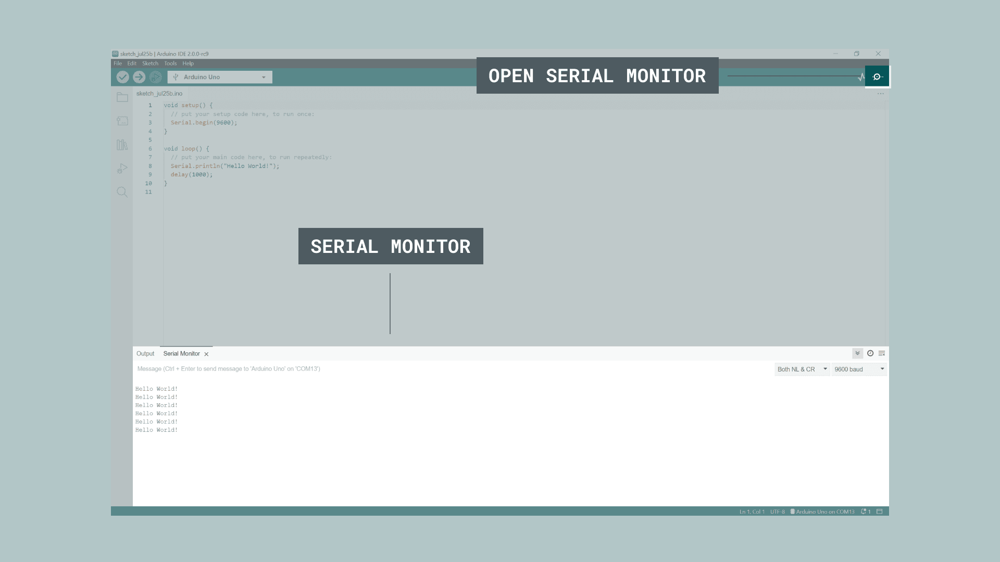

# 빛을 감지하는 조도센서 · Arduino UNO R3

03편은 같은 4핀 모듈의 AO와 DO를 **순서대로** 실습합니다. AO는 밝기 변화를 숫자로 읽고, DO는 모듈이 정한 기준과 비교한 결과를 0·1로 읽습니다. 두 실습은 연결과 코드가 다릅니다.

## 준비물

UNO R3, 데이터용 USB 케이블, **5V 지원 4핀 조도센서 모듈**(VCC/GND/AO/DO), 점퍼선 3개, Arduino IDE. 설명과 표지의 예시 제품은 [SunFounder Photoresistor Module](https://docs.sunfounder.com/projects/umsk/en/latest/01_components_basic/11-component_photoresistor.html)이며 공급 전압은 3.3~5V입니다. 두 다리 LDR 원소자나 3핀 제품은 이 회로와 다릅니다. 핀 위치는 모듈에 인쇄된 이름으로 확인하세요.

## 1. AO를 A0에 연결해 밝기 변화 읽기

USB를 빼고 아래 세 선을 연결합니다. DO는 비워 둡니다.

| UNO | 센서 | 역할 |
| --- | --- | --- |
| 5V | VCC | 전원 |
| GND | GND | 공통 접지 |
| A0 | AO | 아날로그 입력 |
| 연결 안 함 | DO | AO 실습에서 미사용 |



아래 전체 코드를 새 스케치에 복사하거나 [sketch.ino](sketch.ino)를 엽니다.

```cpp
const int CDS_AO_PIN = A0;

void setup() {
  Serial.begin(9600);
}

void loop() {
  int cdsValue = analogRead(CDS_AO_PIN);

  Serial.print("CDS AO: ");
  Serial.println(cdsValue);

  delay(500);
}
```

| 코드 | 역할 |
| --- | --- |
| `CDS_AO_PIN = A0` | A0를 입력 핀으로 지정합니다. |
| `setup()` | 시작할 때 한 번 실행합니다. |
| `Serial.begin(9600)` | 시리얼 속도를 준비합니다. |
| `loop()` | 아래 작업을 반복합니다. |
| `analogRead(CDS_AO_PIN)` | 입력 전압을 0~1023 숫자로 읽습니다. |
| `Serial.print("CDS AO: ")` | 값 앞에 이름을 붙입니다. |
| `Serial.println(cdsValue)` | 값을 출력하고 줄바꿈합니다. |
| `delay(500)` | 0.5초 기다립니다. |

센서를 가리고 손을 떼며 숫자가 어떻게 달라지는지 비교하세요. 이 값은 **lux가 아닙니다**. 기준 SunFounder 모듈에서는 밝을수록 AO 값이 낮아집니다. 다른 회로의 모듈은 방향이 다를 수 있으므로 실제 결과를 확인하세요.

## 2. DO를 D2에 연결하고 L LED 켜기

USB를 다시 뺍니다. A0↔AO 선을 빼고 **D2↔DO**로 옮깁니다. 전원·접지 선은 유지합니다. AO를 비워 둡니다.

| UNO | 센서 | 역할 |
| --- | --- | --- |
| 5V | VCC | 전원 |
| GND | GND | 공통 접지 |
| D2 | DO | 디지털 입력 |
| 연결 안 함 | AO | DO 실습에서 미사용 |



별도의 스케치에 아래 전체 코드 또는 [sketch-do.ino](sketch-do.ino)를 넣습니다. Arduino IDE가 파일 이름과 같은 폴더 생성을 요청하면 허용하세요. **두 .ino 파일을 같은 스케치 폴더에 넣지 마세요.** 각각 setup/loop가 있어 하나씩 업로드해야 합니다.

```cpp
// CODEPLANT TECH 03: 5V-compatible four-pin LDR module, DO example.
const int CDS_DO_PIN = 2;
const int LIGHT_DETECTED = LOW; // SunFounder example; change after checking your module.

void setup() {
  pinMode(CDS_DO_PIN, INPUT);
  pinMode(LED_BUILTIN, OUTPUT);
  Serial.begin(9600);
}

void loop() {
  int state = digitalRead(CDS_DO_PIN);
  digitalWrite(LED_BUILTIN, state == LIGHT_DETECTED ? HIGH : LOW);
  Serial.print("CDS DO: ");
  Serial.println(state);
  delay(500);
}
```

| 코드 | 역할 |
| --- | --- |
| `CDS_DO_PIN = 2` | 센서 DO가 연결된 보드 D2를 지정합니다. |
| `LIGHT_DETECTED = LOW` | 예시 모듈의 기준보다 밝은 상태를 0(LOW)로 지정합니다. 다른 모델은 결과를 확인하고 HIGH로 바꿀 수 있습니다. |
| `pinMode(CDS_DO_PIN, INPUT)` | 모듈의 디지털 출력을 D2에서 입력으로 받습니다. 수동 2핀 스위치가 아닙니다. |
| `pinMode(LED_BUILTIN, OUTPUT)` | UNO의 내장 L LED를 출력으로 설정합니다. 외부 LED 배선은 필요하지 않습니다. |
| `Serial.begin(9600)` | 모니터와 같은 속도로 설정합니다. |
| `digitalRead(CDS_DO_PIN)` | 입력을 0(LOW) 또는 1(HIGH)로 읽습니다. |
| `state == LIGHT_DETECTED ? HIGH : LOW` | 감지 상태이면 LED 켜짐, 아니면 꺼짐으로 결정합니다. |
| `digitalWrite(LED_BUILTIN, ...)` | 결정한 출력을 내장 L LED에 적용합니다. |
| `Serial.print` / `Serial.println` | `CDS DO: ` 뒤에 0·1을 출력합니다. |
| `delay(500)` | 0.5초마다 다시 읽습니다. 짧은 변화가 빠질 수 있으며 정밀 사건 계수용 예제가 아닙니다. |

기준 SunFounder 모듈은 빛이 가변저항으로 정한 기준보다 밝으면 DO=LOW(0), 아니면 HIGH(1)입니다. 코드에서 **0이면 보드 L LED 켜짐, 1이면 꺼짐**입니다. 다른 모델은 출력 방향을 확인하세요.

## Arduino IDE 설정과 화면 안내

Arduino IDE는 코드를 작성하고 보드로 보내는 프로그램입니다. 설치부터 필요하면 [기본 세팅 편](../001-basic-setup/README.md)을 먼저 따라가세요.

1. 실습에 맞는 코드 하나를 새 스케치에 넣습니다.
2. USB를 연결하고 **Tools → Board → Arduino AVR Boards → Arduino Uno**를 선택합니다.
3. **Tools → Port**에서 실제 보드의 포트를 선택합니다. Windows에서는 COM 뒤의 숫자이며 연결 전후 생기는 포트를 비교하세요.


4. 체크 표시(검증)를 누른 뒤 오른쪽 화살표(업로드)를 누릅니다.


5. 시리얼 모니터를 열고 **9600 baud**로 맞춥니다.



이 화면들은 **기본 세팅 편에서 확인한 Arduino 공식 참고 화면**입니다. 이번 센서를 이 PC에서 실행한 캡처가 아닙니다. IDE 2 계열 자료이며 설치한 버전에 따라 위치와 메뉴 모양이 다릅니다. 화면 속 Hello World!는 공식 예제 출력입니다. 이번 예측 출력은 AO 실습에서 `CDS AO: 숫자`, DO 실습에서 `CDS DO: 0` 또는 `CDS DO: 1`입니다. 실제 측정값을 지어내지 않았습니다.

## DO 기준을 직접 조절하기

DO 코드를 실행해 모니터와 L LED를 관찰합니다. 센서를 가렸을 때와 손을 뗐을 때 0·1이 바뀌지 않으면, 모듈의 작은 가변저항 조절기를 조금씩 돌리고 다시 비교하세요. 회전 방향이나 횟수는 모든 제품에 공통으로 약속하지 않습니다. DO 기준을 바꾸는 것이며 AO를 lux로 보정하는 조절이 아닙니다. 기준 근처에서는 주변 빛의 변화로 LED가 깜빡일 수 있습니다.

AO는 0~1023으로 **변화의 크기**를 읽고, DO는 0·1로 **기준을 넘었는지** 읽습니다. 두 .ino 코드와 회로를 섞지 마세요. UNO의 5V 전압을 ESP32/Pico의 3.3V 입력에 그대로 넣으면 안 됩니다.

## 검증과 파일

- 두 코드 모두 추가 라이브러리가 없습니다. Arduino AVR Boards 1.8.6 / UNO R3 컴파일 통과: AO 프로그램 1908 bytes / SRAM 196 bytes, DO 프로그램 2118 bytes / SRAM 196 bytes.
- AO 연결은 diagram.json과 기존 스킬 검사로, DO 연결은 diagram-do.json과 `python verify.py`로 확인합니다. 기존 스킬 검증기는 AO만을 지원하므로 DO 배선을 넣은 파일을 AO 검증에 통과한 것으로 쓰지 않습니다.
- 두 미리보기는 circuit_preview.html / circuit_preview_do.html이며 Wokwi 공식 핀 좌표로 작성했습니다.
- 카드 10장 모두 1080×1350입니다. 마지막 장에도 공통 블루를 유지합니다.
- **실제 하드웨어 업로드·센서 측정·LED 작동은 미시험입니다.** 코드 컴파일과 그림 검수를 실제 실행 검증이라고 쓰지 않습니다.

## 근거와 사진·화면 출처

- [SunFounder 4핀 모듈](https://docs.sunfounder.com/projects/umsk/en/latest/01_components_basic/11-component_photoresistor.html): 공급 전압, AO 방향, DO 비교 결과, 가변저항 기준.
- [Wokwi 모듈 참고](https://docs.wokwi.com/parts/wokwi-photoresistor-sensor): 핀, AO, DO. 시뮬레이터 기본 2.5V/약 100lux 기준은 실제 제품에 고정된 값이 아닙니다.
- [Arduino analogRead](https://docs.arduino.cc/language-reference/en/functions/analog-io/analogRead/), [digitalRead](https://docs.arduino.cc/language-reference/en/functions/digital-io/digitalRead/), [digitalWrite](https://docs.arduino.cc/language-reference/en/functions/digital-io/digitalWrite/).
- [CODEPLANT 기존 조도센서 강의](https://www.youtube.com/watch?v=03Vf5RfLYts): 설명 흐름 참고. 영상의 ESP32 핀·임계값을 UNO로 복사하지 않았습니다.
- [UNO 공식 도형/핀](https://github.com/wokwi/wokwi-elements/blob/main/src/arduino-uno-element.ts), [LDR 모듈 공식 도형/핀](https://github.com/wokwi/wokwi-elements/blob/main/src/photoresistor-sensor-element.ts): 미리보기 @wokwi/elements 1.9.2, MIT.
- UNO 선택 Help Center 원본: https://support.arduino.cc/hc/article_attachments/6366428795164
- [Arduino 업로드 참고 화면](https://docs.arduino.cc/software/ide-v2/tutorials/getting-started/ide-v2-uploading-a-sketch/), [시리얼 참고 화면](https://docs.arduino.cc/software/ide-v2/tutorials/ide-v2-serial-monitor/): Arduino Documentation / Karl Söderby·Jacob Hylén, CC BY-SA 4.0. Help Center 화면은 원본의 사용 조건을 유지합니다.

## 표지 사진 출처

- UNO R3 사진: [SparkFun Electronics / Wikimedia Commons](https://commons.wikimedia.org/wiki/File:Arduino_Uno_-_R3.jpg), [CC BY 2.0](https://creativecommons.org/licenses/by/2.0/). 원본 비율 유지, 카드 안에서 표시 크기만 조절했습니다.
- 4핀 조도센서 모듈 사진: [SunFounder 공식 Photoresistor Module 자료](https://docs.sunfounder.com/projects/umsk/en/latest/01_components_basic/11-component_photoresistor.html). SunFounder 제품 예시이며 모듈의 핀 배치는 제품에 따라 다릅니다. 표시 크기만 조절했습니다. 별도의 자유 이용 라이선스를 확인한 사진으로 표시하지 않습니다.


## 게시용 캡션과 댓글 DM

[caption.md](caption.md)에 이 편의 GitHub 주소와 `git` 댓글 안내를 포함합니다. 이 게시물의 Manychat 버튼은 반드시 `arduino/001-cds-ao` 폴더로 연결합니다. 등록 전에는 이 편의 실제 DM 발송이 켜졌다고 보고하지 않습니다.
