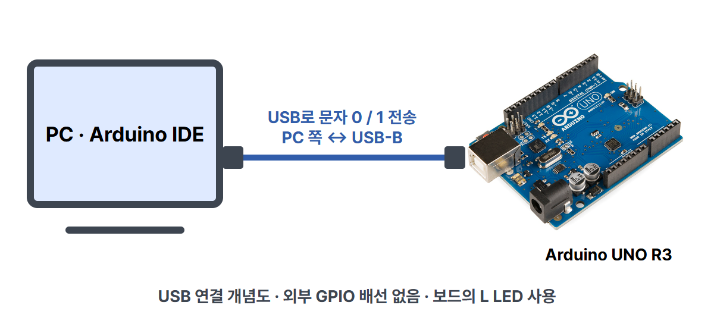

# 입력부터 출력까지, 아두이노 신호처리

Arduino UNO R3 기준입니다. PC에서 문자 `1` 또는 `0`을 보내면, 보드가 조건을 확인하고 내장 L LED를 켜거나 끕니다. 센서 없이 입력 → 처리 → 출력을 먼저 확인합니다.

디지털 GPIO, ADC, PWM의 차이도 함께 구분합니다. **이번 실행 예제의 입력은 USB 시리얼 문자이고, 아날로그 센서나 PWM을 실제로 실행하는 예제는 아닙니다.** 다음 조도센서 편에서 A0의 아날로그 입력을 읽습니다.

## 준비물과 실제 연결

- Arduino UNO R3
- 데이터 전송이 가능한 USB-B 케이블과 PC
- Arduino IDE, Arduino AVR Boards 패키지

| PC / 보드 | 연결 대상 | 역할 |
| --- | --- | --- |
| PC USB 단자 | UNO의 USB-B 단자 | 코드 업로드, 문자 전송, USB 전원 |
| UNO 내장 L LED | 보드 내부에서 D13에 연결 | 디지털 출력 관찰 |
| D0~D12, A0~A5 | 이번 실습에서는 외부 연결 없음 | 센서·저항·점퍼선 불필요 |

`diagram.json`에는 UNO 한 대만 배치했습니다. GPIO 배선은 없습니다. USB는 GPIO 핀 배선으로 표현하지 않았으며, `circuit_preview.html`의 선은 USB 연결을 설명하는 개념선입니다. 실제 센서 회로도가 아닙니다. 내장 L LED에는 외부 저항을 추가하지 않습니다.

## 신호의 차이

| 종류 | 뜻 | UNO R3에서 쓰는 함수 / 값 |
| --- | --- | --- |
| 디지털 입력 | 핀의 전압을 두 상태로 판단 | `digitalRead(pin)` → `LOW`(0) 또는 `HIGH`(1) |
| 디지털 출력 | 핀의 상태를 정함 | `digitalWrite(pin, LOW/HIGH)` |
| 아날로그 입력과 ADC | 연속적으로 변하는 전압을 ADC가 숫자로 변환 | `analogRead(A0)` → 기본 10비트, 0~1023 |
| PWM 출력 | HIGH/LOW를 빠르게 반복하며 켜져 있는 시간의 비율을 정함 | `analogWrite(pin, value)` → 0~255 |

ADC는 Analog-to-Digital Converter, 즉 아날로그 전압을 디지털 숫자로 바꾸는 기능입니다. 기본 기준전압은 보드의 약 5V 전원입니다. 값의 범위와 실제 센서 물리량은 다릅니다. 예를 들어 조도센서의 ADC 숫자를 곧바로 lux라고 부르지 않습니다. 전원·기준전압과 부품의 오차 때문에 정확한 측정에는 보정이 필요합니다.

UNO R3의 아날로그 입력은 A0~A5입니다. PWM 핀은 **3, 5, 6, 9, 10, 11**이며 보드의 `~` 표시로 구분합니다. PWM은 출력 전압을 고정된 중간값으로 만드는 기능이 아닙니다. 켜져 있는 비율을 바꾸는 펄스 신호입니다. 부하·필터에 따른 결과를 구분해야 합니다. 내장 LED의 D13은 UNO R3의 **PWM 핀이 아니며**, 이번 코드는 `digitalWrite()`만 사용합니다.

디지털은 두 상태이지만 GPIO에 임의의 전압을 넣어도 된다는 뜻은 아닙니다. 정확한 입력 판단 전압은 보드 데이터시트에 따릅니다. 센서 모듈의 출력·지원 전압을 확인하세요. 3.3V 보드인 ESP32나 Pico에 UNO용 5V 회로를 그대로 옮기지 않습니다.

센서와 보드가 서로의 전압을 같은 기준에서 비교하도록 센서 GND와 UNO GND를 연결합니다. 별도 전원을 사용하는 회로에서도 공통 GND와 필요한 전압 변환을 확인합니다. 외부 회로를 연결하거나 바꿀 때는 전원을 분리하세요. 외부 모터를 GPIO에 직접 연결하지 않습니다. D0/RX와 D1/TX는 USB 시리얼과 연결된 핀이므로 이 예제에서는 외부 장치를 꽂지 않습니다.

공식 근거: [UNO R3](https://docs.arduino.cc/hardware/uno-rev3/), [ADC 설명](https://docs.arduino.cc/tutorials/uno-rev3-smd/AnalogReadSerial), [PWM 핀과 값](https://support.arduino.cc/hc/en-us/articles/9350537961500-Use-PWM-output-with-Arduino), [PWM 신호 설명](https://docs.arduino.cc/tutorials/generic/secrets-of-arduino-pwm/), [UNO 데이터시트](https://docs.arduino.cc/resources/datasheets/A000066-datasheet.pdf), [공식 핀아웃](https://docs.arduino.cc/resources/pinouts/A000066-full-pinout.pdf).

## Arduino IDE에서 실행하기

카드에는 제품 이름을 Arduino IDE로 표기합니다. 아래 이미지는 Arduino 공식 문서의 **IDE 2 계열 참고 화면**이며, 이 예제를 실제 UNO에서 실행한 캡처는 아닙니다. 설치 버전과 OS에 따라 메뉴 배치·포트 이름이 다릅니다. 상세 설치는 [기본 세팅 편](../001-basic-setup/)을 먼저 확인하세요.

1. PC와 UNO를 데이터용 USB 케이블로 연결합니다.
2. Arduino IDE의 **Tools(도구) → Board(보드) → Arduino AVR Boards → Arduino Uno**를 선택합니다. UNO R4는 선택하지 않습니다.
3. **Tools → Port(포트)**에서 연결한 UNO의 포트를 선택합니다. Windows는 COM 뒤에 숫자가 붙습니다. 다른 사람의 포트 번호를 그대로 쓰지 않습니다.

4. [sketch.ino](sketch.ino)를 내려받아 Arduino IDE에서 엽니다. IDE가 `sketch` 폴더 생성을 요청하면 허용합니다. 또는 아래 전체 코드를 새 스케치에 복사합니다.
5. 체크 표시 **검증(Verify)**으로 컴파일하고, 오른쪽 화살표 **업로드(Upload)**를 누릅니다. 업로드 완료를 확인합니다.
6. **Serial Monitor(시리얼 모니터)**를 열고 속도를 **9600 baud**로 맞춥니다.

이 참고 화면의 출력은 공식 예제의 문장입니다. 이 저장소 코드의 실제 예상 출력은 아래에 따로 표시합니다.

7. 전송 칸에 숫자 모양의 **문자 `1`**을 입력하고 Enter 또는 전송 버튼을 누릅니다. L LED가 켜지고 `LED ON`이 나오는지 확인합니다.
8. **문자 `0`**을 보내면 L LED가 꺼지고 `LED OFF`가 나오는지 확인합니다.
9. `2`, `a`를 보내 보세요. 코드가 무시하므로 LED 상태를 유지하고 새 결과 줄도 출력하지 않습니다.

줄 끝 설정은 No line ending, Newline, Carriage return, Both NL & CR 모두 사용 가능합니다. 코드가 `\r`와 `\n`을 무시합니다. 여러 글자를 한꺼번에 보내면 순서대로 처리합니다. 예를 들어 `10`은 켠 다음 끕니다. 마지막 문자가 `0`이면 꺼진 상태로 끝납니다.

## 예상 출력과 관찰

보드를 시작하거나 리셋하면 L LED를 꺼진 상태로 초기화합니다. 시리얼 모니터를 열 때 UNO가 리셋될 수 있습니다.

~~~text
Send 1: LED ON / Send 0: LED OFF
LED ON
LED OFF
~~~

위 텍스트는 `1`, `0`을 순서대로 보냈을 때 **코드에 따른 예상 결과**입니다. 실제 하드웨어 실행 로그를 제시한 것이 아닙니다. USB 송수신 시 RX/TX LED가 잠깐 깜빡이는 것과, 이번에 제어하는 **L LED**를 구분하세요.

문자 `'1'`은 GPIO에서 읽는 `HIGH`와 다릅니다. 문자 비교에는 작은따옴표를 쓴 `'1'`, `'0'`을 사용합니다. 조건에 맞으면 `HIGH`나 `LOW`를 디지털 출력 핀에 씁니다.

## 전체 코드

~~~cpp
// CODEPLANT TECH 02: UNO R3, serial input -> decision -> built-in LED.
// Send character '1' to turn LED L on, or '0' to turn it off.
// No external GPIO wiring. Serial Monitor: 9600 baud.
void setup() {
  pinMode(LED_BUILTIN, OUTPUT);
  digitalWrite(LED_BUILTIN, LOW);
  Serial.begin(9600);
  Serial.println("Send 1: LED ON / Send 0: LED OFF");
}

void loop() {
  if (Serial.available() > 0) {
    char command = Serial.read();
    if (command == '0' || command == '1') {
      bool on = (command == '1');
      digitalWrite(LED_BUILTIN, on ? HIGH : LOW);
      Serial.println(on ? "LED ON" : "LED OFF");
    }
    // Other characters, including CR and LF, leave the LED unchanged.
  }
}
~~~

| 코드 | 역할 |
| --- | --- |
| `setup()` | 시작할 때 한 번 실행 |
| `pinMode(LED_BUILTIN, OUTPUT)` | UNO R3의 D13 내장 LED를 출력으로 설정 |
| `digitalWrite(LED_BUILTIN, LOW)` | 처음 LED를 끔 |
| `Serial.begin(9600)` | 9600 baud로 시리얼 통신 준비 |
| 첫 `Serial.println(...)` | 입력 방법을 한 줄로 표시 |
| `loop()` | 계속 반복하며 입력 확인 |
| `Serial.available() > 0` | 받은 문자가 있을 때만 읽음 |
| `char command = Serial.read()` | 문자 하나를 읽어 저장 |
| `command == '0' \|\| command == '1'` | 문자 0 또는 1인지 판단 |
| `bool on = (command == '1')` | 1이면 참, 0이면 거짓 |
| `on ? HIGH : LOW` | 참이면 HIGH, 거짓이면 LOW를 선택 |
| 두 번째 `Serial.println(...)` | 선택한 상태를 LED ON 또는 LED OFF로 표시 |

외부 라이브러리는 없습니다. 컴파일 기준은 Arduino AVR Boards **1.8.6**, `arduino:avr:uno`입니다. 코드에 `analogRead()`나 `analogWrite()`를 넣지 않았으므로 미연결 핀의 불안정한 값을 센서값처럼 출력하지 않습니다.

## 막혔을 때

| 증상 | 확인할 것 |
| --- | --- |
| 포트가 없음 | 데이터용 케이블인지 확인, 다른 USB 포트 사용 |
| 업로드 실패 | Arduino Uno와 실제 포트 선택, 다른 시리얼 프로그램 종료 |
| 입력해도 LED가 그대로임 | 전송까지 했는지, 문자 1/0인지, L LED를 보고 있는지 확인 |
| 글자가 깨짐 | Serial.begin(9600)과 모니터 속도 9600을 맞춤 |
| `2`를 보내도 반응 없음 | 정상: 0/1 외에는 무시하는 코드 |
| PWM 밝기 조절이 안 됨 | 이 예제는 디지털 켜기/끄기; D13은 UNO R3의 PWM 핀이 아님 |

## 자료와 이미지 출처

2026-10-06 공식 자료를 확인했습니다. 기존 [CODEPLANT 신호처리 영상](https://www.youtube.com/watch?v=E_pGgFKgDfs)은 **ESP32 강의**입니다. 제목·공개 설명의 GitHub 링크를 확인했으며, 자막은 가져올 수 없었습니다. 영상의 ESP32 핀·전압·코드를 UNO에 복사하지 않았습니다. 이번 UNO 예제는 위 Arduino 공식 자료와 UNO의 보드 정의를 근거로 작성했습니다.

| 파일 | 원본·작성자·사용 조건 |
| --- | --- |
| uno-r3-photo.jpg | [SparkFun Electronics / Wikimedia Commons](https://commons.wikimedia.org/wiki/File:Arduino_Uno_-_R3.jpg), [CC BY 2.0](https://creativecommons.org/licenses/by/2.0/); 원본 재사용, 비율 유지해 표시 크기만 조절 |
| ide2-screen.png, ide-serial-screen.png | [Arduino Documentation / Karl Söderby](https://docs.arduino.cc/software/ide-v2/tutorials/ide-v2-serial-monitor/), [원본 문서 저장소 라이선스](https://github.com/arduino/docs-content/blob/main/LICENSE.md); 공식 참고 화면, 이미지 내용 수정 없음 |
| ide-tools-screen.png | [Arduino Help Center 보드·포트 안내](https://support.arduino.cc/hc/en-us/articles/4406856349970-Select-board-and-port-in-Arduino-IDE), [원본 이미지](https://support.arduino.cc/hc/article_attachments/6366428819228), [저장소 라이선스](https://github.com/arduino/help-center-content/blob/main/LICENSE.md); 공식 참고 화면 |
| usb-connection.png, circuit_preview.html | CODEPLANT 작성 USB 개념도; SparkFun UNO 사진 포함, 기술 사양 그림이나 실제 배선 사진이 아님 |

Arduino docs-content의 LICENSE.md는 상단 설명의 CC BY 4.0 링크와 본문 CC BY-SA 4.0 텍스트가 함께 있습니다. 본 자료의 문서와 Documentation 화면을 포함한 표지 카드는 보수적으로 **[CC BY-SA 4.0](https://creativecommons.org/licenses/by-sa/4.0/)**으로 제공합니다. 사진과 외부 화면은 위 원본 조건을 함께 따릅니다. CODEPLANT와 Arduino의 상표·로고 권리는 각 소유자에게 있으며 브랜드의 승인을 받았다는 뜻이 아닙니다.

## 검증 범위

2026-10-06, 설치된 Arduino CLI와 Arduino AVR Boards 1.8.6으로 `arduino:avr:uno` 컴파일을 통과했습니다. 프로그램 1,888바이트, 전역 변수 228바이트입니다. 저장소의 sketch.ino와 위 전체 코드가 같고, diagram.json은 UNO 한 대·외부 GPIO 배선 없음임을 `verify-local.mjs`로 확인했습니다. servo/조도센서 배선 전용 스킬 검증기는 이번 USB 개념도에 적용하지 않았습니다.

기존 check.mjs를 PORT=8773, CODEPLANT_CHECK_EPISODE=arduino-002-signal-processing으로 실행해 6장 전체 레이아웃·블루 배경·사진 로딩·모바일·캡션 복사·저장·카드 내부 이미지 붙여넣기를 확인했습니다. 전체 PNG를 눈으로 검토했으며, 4번 카드의 푸터 겹침을 수정했습니다. 세 관점은 제작자의 자체 검토이며 실제 디자이너·학생·선생님에게 피드백을 받은 것으로 주장하지 않습니다.

**실제 UNO 업로드와 하드웨어 동작은 미시험**입니다. ADC·PWM은 개념 설명이며 실제 측정·파형 확인을 하지 않았습니다. 컴파일 성공과 예상 출력 설명을 실제 보드 실행 성공으로 해석하지 마세요.
