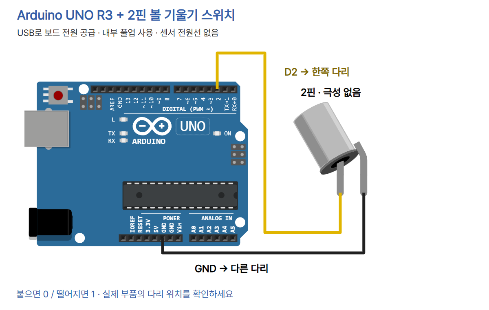

# 기울기를 감지하는 스위치 · Arduino UNO R3

금속 공이 두 접점을 붙이거나 떼는 **2핀 기계식 볼 스위치**를 읽습니다. 각도 측정값을 출력하는 가속도 센서가 아닙니다. 기준 부품은 [Adafruit Tilt ball switch PID 173](https://www.adafruit.com/product/173)의 2핀 접점 형태입니다. VCC·GND·OUT이 있는 3핀 모듈은 이 회로의 대상이 아닙니다.

## 준비물과 연결

UNO R3, 2핀 볼 기울기 스위치, 브레드보드, 점퍼선 2개, USB 데이터 케이블, Arduino IDE가 필요합니다. 보드는 USB로 전원을 공급합니다. USB를 빼고 연결하세요.



| UNO | 스위치 | 의미 |
| --- | --- | --- |
| D2 | 한쪽 다리 | 디지털 입력 |
| GND | 다른 다리 | 접지 |
| 5V / VIN | 연결하지 않음 | 센서 전원선 없음 |

이 수동 접점 부품은 두 다리를 바꿔 연결해도 됩니다. 다리는 브레드보드의 **서로 연결되지 않은 줄**에 꽂으세요. 같은 연결 줄에 꽂으면 접점이 항상 붙은 것처럼 읽힙니다. 사진의 브레드보드는 부품 형태 참고이며, 실제 연결은 위 배선도와 표를 따릅니다.

`INPUT_PULLUP`으로 UNO 내부 풀업 저항을 켭니다. 열린 입력은 HIGH(1), 접점이 닫혀 D2가 GND에 이어지면 LOW(0)입니다. 외부 저항과 별도의 센서 전원선은 필요하지 않습니다. 핀을 OUTPUT으로 바꿔 이 스위치에 연결하지 마세요.

## Arduino IDE에서 실행하기

Arduino IDE는 코드를 작성하고 컴파일해 보드로 보내는 프로그램입니다. 처음 설치한다면 [기본 세팅 편](../001-basic-setup/README.md)을 먼저 따라가세요. 아래는 **Arduino 공식 참고 화면**이며 이 PC에서 이번 센서를 실행한 캡처가 아닙니다. IDE 2 계열 참고 화면으로, 설치 버전에 따라 메뉴 위치가 다를 수 있습니다. 카드의 제품명은 Arduino IDE로 통일합니다.

1. [sketch.ino](sketch.ino)의 전체 코드를 새 스케치에 복사합니다. IDE가 동일한 이름의 폴더 생성을 요청하면 허용합니다.
2. USB를 연결합니다. 보드 목록 또는 **Tools → Board → Arduino AVR Boards → Arduino Uno**를 선택합니다. R4 등 다른 보드로 선택하지 마세요.
3. **Tools → Port**에서 이 보드의 포트를 선택합니다. Windows에서는 COM 뒤에 숫자가 붙습니다. 연결 전후 생긴 포트를 비교하고 다른 사람의 COM 번호를 복사하지 마세요.


4. 체크 표시(검증)를 눌러 컴파일합니다. 오른쪽 화살표(업로드)를 눌러 UNO로 보냅니다.


5. 시리얼 모니터를 열고 속도를 **9600 baud**로 맞춥니다. 화면을 연 뒤 UNO의 RESET을 누르면 최초 상태도 다시 볼 수 있습니다. 이 실습은 문자열 전송을 요구하지 않습니다.


위 참고 화면의 Hello World!는 공식 예제의 출력입니다. 이번 코드의 예상 출력은 아래처럼 0 또는 1입니다. 실제 출력 기록이 아닙니다.

```text
1
0
1
```

센서를 천천히 기울이고 잠깐 멈추세요. 접점이 붙은 상태에서는 **0과 L LED 켜짐**, 떨어진 상태에서는 **1과 L LED 꺼짐**을 비교합니다. 최초 한 번과 안정된 상태가 바뀔 때만 출력하므로 숫자가 계속 올라오지 않아도 정상일 수 있습니다. 부품을 고정한 방향에 따라 어느 쪽에서 접점이 붙는지 달라집니다. 특정 각도나 방향을 모든 부품에 공통으로 약속하지 않습니다.

## 전체 코드

아래 코드는 [sketch.ino](sketch.ino)와 같습니다. 추가 라이브러리는 필요하지 않습니다. Arduino AVR Boards 1.8.6을 사용해 UNO R3 대상으로 컴파일했습니다.

```cpp
// CODEPLANT TECH 04: two-pin mechanical ball tilt switch
const byte TILT_PIN = 2;
const unsigned long DEBOUNCE_MS = 50; // Increase if contacts flicker.
int lastRaw = HIGH;
int stableState = HIGH;
unsigned long changedAt = 0;

void setup() {
  pinMode(TILT_PIN, INPUT_PULLUP);
  pinMode(LED_BUILTIN, OUTPUT);
  Serial.begin(9600);
  lastRaw = digitalRead(TILT_PIN);
  stableState = lastRaw;
  changedAt = millis();
  digitalWrite(LED_BUILTIN, stableState == LOW ? HIGH : LOW);
  Serial.println(stableState); // Initial state, then only stable changes.
}

void loop() {
  int raw = digitalRead(TILT_PIN);
  unsigned long now = millis();
  if (raw != lastRaw) {
    lastRaw = raw;
    changedAt = now;
  }
  if (raw != stableState && now - changedAt >= DEBOUNCE_MS) {
    stableState = raw;
    digitalWrite(LED_BUILTIN, stableState == LOW ? HIGH : LOW);
    Serial.println(stableState);
  }
}
```

## 코드의 각 줄과 역할

| 구문 | 역할 |
| --- | --- |
| `TILT_PIN = 2` | D2에서 읽습니다. 회로도·연결표와 동일합니다. |
| `DEBOUNCE_MS = 50` | 입력이 50ms 유지돼야 새 상태로 확정합니다. 흔들림이 남으면 이 값을 늘려 비교합니다. |
| `lastRaw`, `stableState` | 직전 원시 입력과 확정된 상태를 각각 저장합니다. |
| `changedAt` | 원시 입력이 마지막으로 바뀐 시간을 저장합니다. |
| `setup()` | 시작 또는 리셋할 때 한 번 실행합니다. |
| `pinMode(TILT_PIN, INPUT_PULLUP)` | D2를 입력으로 쓰고 내부 풀업을 켭니다. |
| `pinMode(LED_BUILTIN, OUTPUT)` | UNO R3 내장 L LED를 출력으로 제어합니다. 외부 LED를 연결하지 않습니다. |
| `Serial.begin(9600)` | 시리얼 통신 속도를 설정합니다. 모니터도 9600으로 맞춥니다. |
| 최초 `digitalRead`, 상태 대입, `millis()` | 시작할 때 현재 입력과 기준 시간을 가져옵니다. 최초 상태는 필터 없이 반영합니다. |
| 최초 `digitalWrite`, `Serial.println` | 처음 LED와 숫자를 표시합니다. |
| `loop()` | 이후 입력 확인을 계속 반복합니다. |
| `raw = digitalRead(TILT_PIN)` | 지금 입력을 0 또는 1로 읽습니다. |
| `now = millis()` | 부팅 후 지난 밀리초를 가져옵니다. |
| `if (raw != lastRaw)` | 원시 값이 바뀌면 새 원시 값과 시각을 저장합니다. |
| 두 번째 `if` | 기존 확정값과 다르며 50ms 이상 유지됐는지 확인합니다. |
| `stableState = raw` | 조건을 만족한 원시 값을 새 확정값으로 저장합니다. |
| `stableState == LOW ? HIGH : LOW` | 입력 0이면 LED 출력 HIGH, 입력 1이면 LOW로 바꿉니다. |
| `Serial.println(stableState)` | 확정된 상태가 바뀌었을 때만 숫자를 줄바꿈해 출력합니다. |
| 닫는 중괄호 | 해당 조건문·함수 범위가 끝납니다. |

볼 스위치는 금속 공이 흔들려 접점이 짧게 반복해서 붙고 떨어질 수 있습니다. 이를 **접점 튐(바운스)**이라고 합니다. 이 예제는 바뀐 입력이 50ms 지속된 뒤 확정하는 디바운스 처리를 씁니다. 흔들림이 계속되면 확정이 늦어지며, 아주 짧은 접점 변화는 기록하지 않습니다. 움직임 횟수를 정밀하게 세는 코드는 아닙니다. 시간 차이를 unsigned long 뺄셈으로 비교하므로 millis()가 순환하는 경계도 처리합니다.

## 값이 바뀌지 않을 때

- 항상 0: 다리가 같은 브레드보드 연결 줄인지, D2와 GND가 직접 이어졌는지 확인합니다.
- 항상 1: 빠진 선·접촉 불량을 확인하고 천천히 다른 방향으로 기울여 접점이 붙는 위치를 찾습니다.
- 글자가 깨짐: 시리얼 모니터 속도를 9600으로 맞춥니다.
- 업로드 실패: Arduino Uno와 실제 COM 포트, 데이터 가능한 USB 케이블을 확인합니다.
- LED·숫자가 늦게 바뀜: 잠깐 멈추세요. 값이 흔들리는 동안은 50ms 타이머가 다시 시작됩니다.

## 회로 편집과 검증 범위

`diagram.json`은 공식 부품 좌표와 배선 경로를 저장하는 CODEPLANT 편집용 데이터입니다. `circuit_preview.html`은 Wokwi UNO 도형과 Fritzing 2핀 부품 도형으로 이를 보여 줍니다. Wokwi의 `wokwi-tilt-switch`는 **3핀 모듈**이어서 실제 2핀 부품을 대신 쓰지 않았습니다. 이 자료를 Wokwi에서 바로 실행할 수 있는 시뮬레이션 프로젝트로 표시하지 않습니다.

배선 검사는 이 편의 폴더 안에서 `python verify.py`로 실행합니다. 아래 편집기 검사는 로컬 마케팅 제작 작업폴더 기준입니다.

```powershell
python episodes/arduino-004-tilt/verify.py
$env:PORT = '8773'
$env:CODEPLANT_CHECK_EPISODE = 'arduino-004-tilt'
node check.mjs
```

- UNO R3 컴파일 통과: Arduino AVR Boards **1.8.6**, 프로그램 **2456 bytes**, SRAM **196 bytes**.
- `verify.py`: 공식 SVG 다리 끝 좌표·배선 시작/끝·net·D2 코드·연결표·캡션 URL 검사.
- 카드 6장의 사진 누락·푸터 겹침·공통 블루 배경·모바일 표시 검사 통과. 편집 저장/재열기·캡션 복사·이미지 붙여넣기·한 차시 PNG ZIP 다운로드 검사 통과. ZIP 안의 6장 모두 1080×1350입니다.
- **실제 보드 업로드·스위치 동작·시리얼 수신·하드웨어 시험은 수행하지 않았습니다.**
- 이 새 2핀 회로는 기존 스킬 검증기의 서보/조도센서 범위 밖이어서 위 전용 검사로 확인합니다.

## 출처와 사용 조건

- 실제 UNO R3 사진: [SparkFun Electronics / Wikimedia Commons](https://commons.wikimedia.org/wiki/File:Arduino_Uno_-_R3.jpg), [CC BY 2.0](https://creativecommons.org/licenses/by/2.0/). 기존 확인된 원본을 재사용하고 표시 크기만 조절했습니다.
- 실제 기울기 스위치 사진: **lady ada / Adafruit**, [asset 496](https://learn.adafruit.com/assets/496), [CC BY-SA 3.0](https://creativecommons.org/licenses/by-sa/3.0/). 브레드보드에 꽂힌 실제 2핀 부품 사진이며 잘라내거나 생성한 사진이 아닙니다. 원본 비율 유지, 표시 크기만 조절했습니다.
- 동작 근거: [Adafruit 구조·접점 설명](https://learn.adafruit.com/tilt-sensor/overview), [내부 풀업과 접점 튐 설명](https://learn.adafruit.com/tilt-sensor/using-a-tilt-sensor), [Arduino InputPullupSerial](https://docs.arduino.cc/built-in-examples/digital/InputPullupSerial/).
- UNO 도형·핀 좌표: [Wokwi elements](https://github.com/wokwi/wokwi-elements/blob/main/src/arduino-uno-element.ts), MIT. 미리보기는 고정 버전 @wokwi/elements 1.9.2를 사용합니다.
- 2핀 도형: **Fritzing / Lionel Michel**, [공식 부품 정의](https://github.com/fritzing/fritzing-parts/blob/develop/core/Tilt%20switch.fzp), [공식 SVG](https://github.com/fritzing/fritzing-parts/blob/develop/svg/core/breadboard/tilt_switch.svg), [CC BY-SA 3.0](https://github.com/fritzing/fritzing-parts/blob/develop/LICENSE.txt). 원본 도형을 확대하고 두 다리 끝에 배선을 추가했습니다. 회로 PNG와 이를 담은 카드는 같은 CC BY-SA 3.0으로 제공합니다.
- Arduino 참고 화면: 기본 세팅 편에서 확인한 원본을 재사용했습니다. [UNO 선택 Help Center 화면](https://support.arduino.cc/hc/article_attachments/6366428795164), [업로드 안내](https://docs.arduino.cc/software/ide-v2/tutorials/getting-started/ide-v2-uploading-a-sketch/), [시리얼 모니터 안내](https://docs.arduino.cc/software/ide-v2/tutorials/ide-v2-serial-monitor/). Documentation 화면은 Arduino Documentation의 CC BY-SA 4.0 조건, Help Center 화면은 원본의 사용 조건을 따릅니다. 이번 코드 실행 화면으로 제시하지 않습니다.
- [CODEPLANT 유튜브](https://www.youtube.com/@codeplant2024/videos)의 공개 목록을 2026-10-07 확인했습니다. 이번 조사에서는 2핀 기울기 스위치에 대응하는 개별 영상을 확정하지 못했으므로 특정 영상의 배선·코드를 검증했다고 쓰지 않습니다.

이 안내문·카드뉴스는 CC BY-SA 3.0으로 제공합니다. 참고 화면과 각 원본 자산은 위에 명시한 별도 조건을 유지합니다. 로고·상표 권리는 각 소유자에게 있습니다. 카드 6장, 각 1080×1350px이며 핵심 코드와 예측 관찰 결과를 담습니다. 소스 전체 코드는 위 파일을 사용하세요.

## 게시용 캡션

[caption.md](caption.md)에 편별 링크·해시태그·사진 출처를 담았습니다. `git` 댓글 DM은 **이 게시물을 올린 뒤 해당 폴더 URL로 Manychat 자동화를 연결해야 합니다.** 이 편은 아직 Instagram에 게시하거나 DM 자동화에 등록하지 않았습니다.
