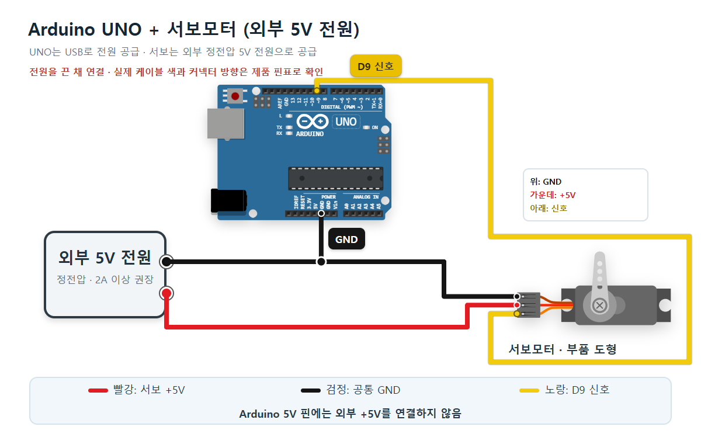

# 각도를 바꾸는 서보모터 · Arduino UNO R3

**TowerPro SG90 Digital** 3선 위치 제어 서보 한 개를 사용합니다. 60 → 90 → 120 명령을 1초 간격으로 보내고 혼(축에 끼우는 팔)의 위치를 비교합니다. 출력 숫자는 보낸 명령이며 실제 측정 각도가 아닙니다. 연속 회전형 서보에는 이 예제를 적용하지 않습니다.

## 준비물과 전원

- Arduino UNO R3, 데이터 통신이 되는 USB 케이블, Arduino IDE
- TowerPro SG90 Digital 한 개와 혼, 점퍼선·서보 커넥터에 맞는 연결핀
- **정전압 DC 5V 외부 전원**, 한 개 실습에는 **2A 이상 용량 권장**

[제조사 제품 페이지](https://towerpro.com.tw/product/sg90-7/)의 명목 전압은 4.8V입니다. 같은 페이지의 제조사 답변은 4.8~6V 사용과 약 0.5~2A 동작 전류를 안내합니다. 이 예제의 **5V·2A 이상은 그 범위를 고려한 제작상의 권장 선택**입니다. 2A가 서보에 강제로 흐른다는 뜻은 아니며 전류는 부하에 따라 달라집니다. 다른 SG90 호환품·변형 모델은 자체 전원 사양을 먼저 확인하세요.

보드는 USB로, 서보는 외부 전원으로 공급합니다. 전압을 모르는 어댑터·직결 리튬 배터리로 대체하지 않습니다. 처음에는 혼에 다른 기구나 무게를 달지 않습니다. [Adafruit 전원 설명](https://learn.adafruit.com/using-servos-with-circuitpython/hardware)도 서보의 높은 전류를 고려한 별도 전원과 공통 접지를 권장합니다.

## 회로 연결

**USB와 외부 전원을 모두 끈 채 배선**합니다. 서보 케이블의 역할을 제품 핀표로 확인하고, 느슨한 선이나 노출된 연결핀끼리 닿지 않게 고정합니다.



| 서보 선 | 연결할 곳 | 역할 |
| --- | --- | --- |
| 전원(보통 빨강) | 외부 +5V | 모터 전원 |
| 접지(갈색/검정) | 외부 − · UNO GND | 공통 기준 |
| 신호(주황/노랑) | UNO D9 | 위치 명령 |

회로 그림의 검정·노랑은 **배선을 구별하는 표시 색**입니다. 실제 SG90 케이블은 갈색·빨강·주황인 경우가 많지만 색만으로 결선하지 말고 제품 핀표를 확인하세요. 그림에서 서보 단자는 위부터 GND, V+, 신호입니다. 실제 커넥터를 어느 방향에서 보는지에 따라 위아래가 뒤집힐 수 있습니다.

- 외부 전원의 −, 서보 접지, UNO GND가 서로 이어져야 D9 신호의 기준이 같아집니다.
- **외부 +5V는 서보의 전원선에만 연결**합니다. 이 실습에서는 UNO 5V·3.3V·VIN에 외부 +5V를 연결하지 않습니다.
- D9는 제어 신호만 전달합니다. `analogWrite()`의 0~255 밝기 조절과 달리 `Servo`가 위치 제어용 펄스를 만듭니다. UNO에서는 Servo가 Timer1을 사용하므로 사용 중 D9/D10의 `analogWrite()` 출력에 영향을 줍니다.
- 배선표와 `diagram.json`은 같은 네 개 연결을 표현합니다. 브레드보드는 필수가 아니며 접지 분기에 연결 단자 또는 브레드보드를 쓸 경우 모든 접지가 실제로 이어졌는지 확인합니다.

## Arduino IDE에서 실행하기

Arduino IDE는 코드를 작성하고 컴파일해서 보드로 보내는 프로그램입니다. 설치가 처음이라면 [기본 세팅 편](../001-basic-setup/README.md)을 먼저 따라가세요. 이 PC의 설치 버전은 **Arduino IDE 2.3.4**입니다. 아래 그림은 기존 편에서 확인한 **Arduino 공식 IDE 2 계열 참고 화면**이며, 이번 서보를 실행한 실제 캡처가 아닙니다. 설치 버전에 따라 메뉴 모양이 다를 수 있습니다.

1. 새 스케치를 열고 아래 전체 코드 또는 [sketch.ino](sketch.ino)를 복사합니다. IDE가 스케치와 같은 이름의 폴더 생성을 요청하면 허용합니다.
2. `Servo.h: No such file or directory` 오류가 나오면 **Tools → Manage Libraries**(또는 라이브러리 관리자)에서 **Servo by Michael Margolis, Arduino**를 찾아 설치합니다. 이 자료는 **Servo 1.2.2**로 컴파일했습니다. 다른 이름의 서보 라이브러리를 설치하지 않습니다.
3. USB로 UNO를 연결합니다. **Tools → Board → Arduino AVR Boards → Arduino Uno**를 선택하고 **Tools → Port**에서 실제 보드의 COM 포트를 고릅니다. 다른 PC의 COM 번호를 그대로 복사하지 않습니다.


4. 체크 표시(검증)로 컴파일합니다. 배선 확인 후 오른쪽 화살표(업로드)로 보드에 보냅니다. 보드에 다른 프로그램이 남아 있다면 새 코드 업로드가 끝날 때까지 서보 외부 전원을 꺼 두세요.


5. 시리얼 모니터를 **9600 baud**로 열고 외부 서보 전원을 켭니다. RESET을 눌러 처음부터 시작합니다. 명령 90을 먼저 보낸 뒤 60 → 90 → 120이 반복됩니다. 모니터를 연 시점에 따라 첫 줄은 다를 수 있습니다. 입력 문자를 보낼 필요는 없습니다.


공식 참고 화면의 `Hello World!`는 원본 예제의 출력입니다. 이번 코드의 **예상 출력**은 아래와 같으며 실제 수신 기록이 아닙니다.

```text
command=90
command=60
command=90
command=120
command=60
...
```

축을 손으로 잡거나 억지로 돌리지 말고 세 위치로 번갈아 움직이는지 관찰하세요. 숫자는 실제 위치에 도착했는지 알려 주지 않습니다. 혼을 아직 끼우지 않았다면 90 명령만 보내는 스케치로 먼저 가운데 부근을 확인하고, 전원을 끈 뒤 혼을 끼워 고정합니다. 고정할 때 축을 강제로 돌리지 않습니다.

## 전체 코드

아래 코드는 [sketch.ino](sketch.ino)와 같습니다. [libraries.txt](libraries.txt)는 Wokwi용 라이브러리 이름입니다. 실제 Arduino IDE에서는 위의 라이브러리 관리자를 사용하세요.

```cpp
#include <Servo.h>

Servo servoMotor;
const int SERVO_PIN = 9;
// Start with the standard pulse range; calibrate against the actual servo.
const int MIN_PULSE_US = 1000;
const int MAX_PULSE_US = 2000;
const unsigned long HOLD_MS = 1000;

void moveToAngle(int commandAngle) {
  servoMotor.write(commandAngle);
  Serial.print("command=");
  Serial.println(commandAngle);
  delay(HOLD_MS);
}

void setup() {
  Serial.begin(9600);
  servoMotor.attach(SERVO_PIN, MIN_PULSE_US, MAX_PULSE_US);
  moveToAngle(90);
}

void loop() {
  moveToAngle(60);
  moveToAngle(90);
  moveToAngle(120);
}
```

## 각 줄의 역할

| 코드 | 하는 일 |
| --- | --- |
| `#include <Servo.h>` | 서보 제어 라이브러리를 가져옵니다. |
| `Servo servoMotor;` | 서보 한 개를 제어할 객체를 만듭니다. |
| `SERVO_PIN = 9` | 회로의 신호 핀 D9를 지정합니다. |
| 주석 `// Start...` | 펄스 범위는 실제 서보에 맞춰 보정할 시작값임을 알립니다. |
| `MIN_PULSE_US = 1000` | 명령 0에 대응시키는 펄스 길이의 시작 설정입니다. 단위는 µs입니다. |
| `MAX_PULSE_US = 2000` | 명령 180에 대응시키는 펄스 길이의 시작 설정입니다. 명령 180을 실행한다는 뜻은 아닙니다. |
| `HOLD_MS = 1000` | 한 위치에 머무는 시간을 1000ms(1초)로 정합니다. |
| `void moveToAngle(int commandAngle)` | 위치 명령 하나를 받아 보내고 기다리는 함수를 만듭니다. |
| `servoMotor.write(commandAngle)` | 목표 명령을 서보 제어 신호로 바꿉니다. |
| `Serial.print("command=")` | 줄바꿈 없이 명령 표시 문자를 출력합니다. |
| `Serial.println(commandAngle)` | 명령 숫자를 출력하고 다음 줄로 넘어갑니다. |
| `delay(HOLD_MS)` | 다음 명령 전에 1초 기다립니다. 펄스 생성은 라이브러리가 계속 수행합니다. |
| `void setup()` | 전원 켜짐·리셋 때 한 번 실행하는 부분입니다. |
| `Serial.begin(9600)` | 시리얼 통신을 9600 baud로 시작합니다. |
| `servoMotor.attach(...)` | D9와 지정한 펄스 범위를 서보 객체에 연결합니다. |
| setup의 `moveToAngle(90)` | 먼저 가운데 부근을 명령하고 1초 기다립니다. |
| `void loop()` | 이후 반복하는 부분입니다. |
| loop의 `moveToAngle(60)` | 첫 위치를 명령·출력하고 기다립니다. |
| loop의 `moveToAngle(90)` | 두 번째 위치를 명령·출력하고 기다립니다. |
| loop의 `moveToAngle(120)` | 세 번째 위치를 명령·출력하고 기다립니다. |
| `{`와 `}` | 각 함수에 들어가는 코드의 시작과 끝을 표시합니다. |

## 펄스 보정과 관찰

[Servo 공식 API](https://github.com/arduino-libraries/Servo/blob/master/docs/api.md)는 1000~2000µs를 표준적인 서보 펄스 범위로 설명하며 제품별 차이도 명시합니다. 이 코드는 그 값을 **초기 설정**으로 사용합니다. `attach(9)`만 쓰는 라이브러리 기본 범위 544~2400µs와는 다릅니다. 실제 SG90 Digital의 각도별 보정표를 측정한 값으로 제시하지 않습니다.

설정상 명령 60·90·120은 약 1333·1500·1666µs가 됩니다. 실제 축 각도는 제품 응답과 혼의 장착 위치에 따라 달라지므로 원하는 위치가 나오도록 `MIN_PULSE_US`와 `MAX_PULSE_US`를 **작은 폭으로 조정하며 확인**해야 합니다. 제조사 제품 페이지는 일반 모델을 별도 180°/360° 표기가 없으면 0~150° 동작으로 안내하므로 SG90가 모두 180° 돈다고 약속하지 않습니다. 처음부터 0·180 명령이나 끝단까지의 스윕을 추가하지 않습니다.

- 먼저 90 명령 한 개만 실행해 전원·중앙 부근 움직임을 확인합니다. 소음·막힘이 있으면 전원을 끄고 핀표와 정전압 전원을 확인합니다.
- 정상일 때 세 명령을 실행합니다. 값이 커질수록 어느 쪽으로 도는지는 장착 방향을 보고 직접 기록합니다.
- 위치를 바꾸려면 `loop()`의 60·90·120을 가운데 가까운 값부터 조정합니다. 시간이 너무 짧다면 `HOLD_MS`를 늘립니다.
- `servoMotor.read()`도 실제 각도를 재는 함수가 아니라 마지막 명령값을 돌려줍니다. 각도 측정이 필요하면 별도 측정 장비나 위치 피드백이 필요합니다.
- 기어가 갈리는 소리, 심한 떨림, 뜨거워짐, 정지 상태에서 힘만 쓰는 현상이 있으면 즉시 전원을 끕니다. 기계적 끝단을 넘기는 동작을 계속시키지 않습니다.

## 잘 안 될 때

| 증상 | 확인할 것 |
| --- | --- |
| 숫자만 나오고 움직이지 않음 | 외부 전원 켜짐·정전압 5V, 공통 GND, 실제 신호선이 D9인지 확인합니다. |
| 보드가 리셋되거나 떨림 | 서보 전원을 USB/UNO 핀에서 가져오지 않았는지, 외부 전원 용량·접촉을 확인합니다. |
| 일정 방향으로 계속 회전 | 연속 회전형인지 모델을 확인합니다. 이번 실습은 위치 제어형입니다. |
| 숫자가 깨짐 | 시리얼 모니터를 9600 baud로 맞춥니다. |
| 업로드 오류 | Arduino Uno·COM 포트·데이터 USB 케이블을 확인합니다. |
| `Servo.h` 오류 | Arduino의 Servo 라이브러리를 설치했는지 확인합니다. |

## 회로 편집과 검증 범위

[diagram.json](diagram.json)은 Wokwi 형식의 부품·배선 데이터이며 [circuit_preview.html](circuit_preview.html)은 같은 연결을 공식 Wokwi 부품 도형으로 표시합니다. 그림은 제작한 설명용 회로이며 실제 보드 연결 사진이나 실제 실행 결과 캡처가 아닙니다. 서보 도형은 3선 서보를 나타내며 SG90 제품 사진과는 구분합니다. 전원 용량·부하·기계적 끝단은 시뮬레이터만으로 확인할 수 없습니다.

이 편의 폴더에서 `python verify.py`로 배선·공식 핀 좌표·코드/README 일치를 검사합니다. 제작 작업폴더에서는 아래 기존 검사도 실행합니다.

```powershell
python episodes/arduino-005-servo-motor/verify.py
$env:PORT = '8773'
$env:CODEPLANT_CHECK_EPISODE = 'arduino-005-servo-motor'
node check.mjs
```

- UNO R3 컴파일 통과: Arduino AVR Boards **1.8.6**, Servo **1.2.2**, 프로그램 **3168 bytes**, SRAM **237 bytes**.
- 외부 +5V, 공통 GND, D9 신호 연결을 스킬의 회로 검증기로 확인했습니다.
- 카드 7장의 사진·잘림·하단 겹침·공통 블루 배경·모바일 표시 검사 통과. 캡션 복사·편집 저장/재열기·이미지 붙여넣기·한 차시 PNG ZIP 다운로드 검사 통과. ZIP의 7장 모두 1080×1350입니다.
- **실제 UNO 업로드·서보 움직임·각도 측정·전원 전류·시리얼 수신은 시험하지 않았습니다.**

## 출처와 사용 조건

2026-10-08 공개 원본을 확인했습니다.

- 실제 UNO R3 사진: [SparkFun Electronics / Wikimedia Commons](https://commons.wikimedia.org/wiki/File:Arduino_Uno_-_R3.jpg), [CC BY 2.0](https://creativecommons.org/licenses/by/2.0/). 기존 원본을 재사용하고 비율을 유지해 표시 크기만 조절했습니다.
- 실제 서보 사진: **TowerPro SG90 Digital 공식 제품 사진**, [제품 페이지](https://towerpro.com.tw/product/sg90-7/), [원본 SG90-D2.jpg](https://towerpro.com.tw/wp-content/uploads/2014/08/SG90-D2.jpg). 원본에 Digital 9g / SG90 표시가 있습니다. 원본 워터마크를 유지하고 잘라내거나 생성·합성하지 않았습니다. 사이트는 **Copyright © 2014 Torq Pro & Tower Pro. All Rights Reserved**를 표시하며 별도의 자유 이용 라이선스는 확인되지 않았습니다. 사진의 권리를 CC로 재허락하지 않습니다.
- 전압·전류·회전 범위 근거: 위 TowerPro 제품 사양 및 제조사 답변(2021-11-07, 2022-03-02). 5V·2A 이상 외부 전원은 이 자료의 실습 설계 권장입니다.
- 케이블 역할·전원·공통 GND: [Adafruit Hardware](https://learn.adafruit.com/using-servos-with-circuitpython/hardware).
- 코드·펄스·명령값·타이머 근거: [Arduino Servo API](https://github.com/arduino-libraries/Servo/blob/master/docs/api.md), [Servo 소스](https://github.com/arduino-libraries/Servo/blob/1.2.2/src/Servo.h). 위 실습 코드는 CODEPLANT가 작성했으며 Servo 라이브러리 자체는 원본 라이선스 조건을 따릅니다.
- 회로 도형·좌표: [Wokwi UNO](https://github.com/wokwi/wokwi-elements/blob/main/src/arduino-uno-element.ts), [Wokwi 서보](https://github.com/wokwi/wokwi-elements/blob/main/src/servo-element.ts), MIT. 미리보기 버전은 @wokwi/elements 1.9.2입니다.
- Arduino 공식 참고 화면: 기존 기본 세팅 편의 원본을 재사용했습니다. [UNO 선택 Help Center](https://support.arduino.cc/hc/article_attachments/6366428795164), [업로드 안내](https://docs.arduino.cc/software/ide-v2/tutorials/getting-started/ide-v2-uploading-a-sketch/), [시리얼 모니터 안내](https://docs.arduino.cc/software/ide-v2/tutorials/ide-v2-serial-monitor/). Documentation 화면은 CC BY-SA 4.0 조건, Help Center 화면은 원본 사용 조건을 유지합니다. 이번 서보의 실제 실행 화면으로 표시하지 않습니다.
- [CODEPLANT ESP32 서보모터 강의](https://www.youtube.com/watch?v=T1hUZ203-2Y)의 공개 제목·설명을 확인했습니다. ESP32 강의이며 자막·영상 전체 실습을 검증한 것은 아닙니다. 이번 UNO 핀·코드는 Arduino 공식 자료를 근거로 작성했습니다.

작성한 안내문과 실습 코드는 CC BY 4.0으로 제공합니다. 사진·공식 참고 화면·로고·상표는 위 원본의 별도 조건을 유지합니다. 카드 7장, 각 1080×1350px입니다. 편집 가능한 `episode.json`은 로컬 제작 폴더에 보관합니다.

## 게시용 캡션

[caption.md](caption.md)에 해당 폴더 URL과 해시태그 5개, 사진 출처를 담았습니다. `git` 댓글 DM은 **실제 게시물 업로드 뒤 이 폴더 URL로 Manychat을 연결**해야 합니다. 오늘 제작한 이 편은 아직 Instagram에 게시하거나 DM 자동화에 등록하지 않았습니다.
