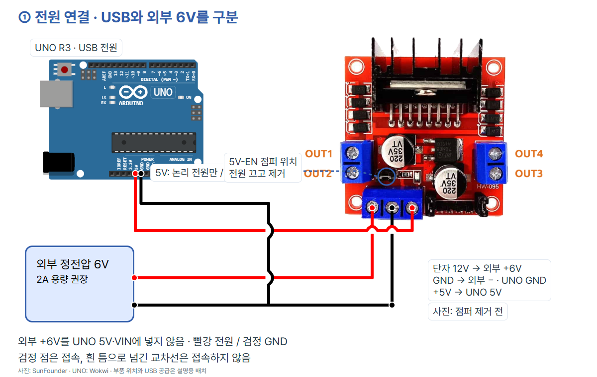
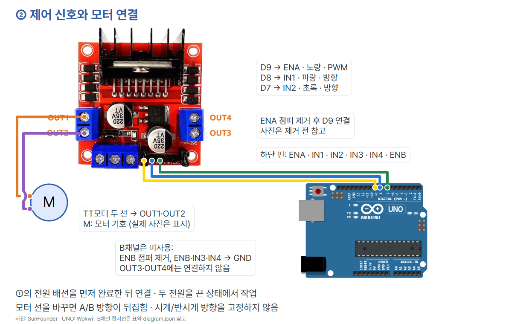

# 방향과 속도를 바꾸는 DC모터 · Arduino UNO R3

SunFounder **L298N 모듈(HW-095 사진과 같은 단자형)**과 **Adafruit TT모터 #3777(정격 3~6V)** 한 개로 실습합니다. A/B는 상대 방향 이름이며, 모터 두 선을 바꾸면 반대로 보입니다. 서보의 각도 명령과 달리 회전을 계속 구동합니다. PWM 숫자는 RPM 측정값이 아닙니다.

## 준비물·전원 선택

UNO R3, USB 데이터 케이블, Arduino IDE, 위 L298N·모터, 점퍼선, 접지 분기용 연결 단자, 나사 드라이버, **정전압 DC 6V 외부 전원(2A 용량 권장)**을 준비합니다. 모터를 고정하고 무부하로 시작하세요. 연결 단자의 허용 전류도 전원·모터에 맞춰 확인합니다.

[Adafruit](https://www.adafruit.com/product/3777)의 표본 측정에서 6V 무부하 전류는 160mA, 축을 붙잡은 구속 상태는 1.5A입니다. 이 수치는 모든 개체의 보증값이 아닙니다. 2A 전원은 한 개 무부하 실습을 위한 제작 권장 용량이며 2A를 계속 흘려도 된다는 뜻이 아닙니다. 축을 붙잡거나 부하를 달아 멈춘 채 구동하지 마세요.

[SunFounder 모듈 문서](https://docs.sunfounder.com/projects/sf-components/en/latest/component_l298n_module.html)는 모터 전원 범위 5~35V, 논리 전원 5V를 안내합니다. 이 예제는 모터 정격에 맞춰 **6V를 선택**하고, 내장 레귤레이터를 쓰지 않도록 **5V-EN 전원 점퍼를 제거**합니다. USB로 동작하는 UNO의 5V는 모듈 논리 회로만 공급합니다. **모터에는 UNO 5V를 쓰지 않습니다.** 외부 +6V를 UNO의 5V·3.3V·VIN에 연결하지 않습니다.

[ST 데이터시트](https://www.st.com/resource/en/datasheet/l298.pdf)의 IC 한 채널 2A 정격을 모듈의 연속 허용 전류로 단정하지 않습니다. 방열·기판·주변 온도에 따라 제한됩니다. L298의 출력 전압 손실 때문에 외부 6V가 모터에 그대로 전달되지 않으며 실제 회전·온도·전류는 측정하지 않았습니다. 부족한 속도를 해결하려고 이 3~6V 모터에 12V를 넣지 마세요.

## 연결 순서와 점퍼

1. USB와 외부 전원을 모두 끕니다. 사진의 **5V-EN, ENA, ENB 점퍼를 제거**합니다. 5V-EN은 제어 핀 ENA/ENB와 다른 전원 점퍼입니다. 실제 인쇄와 제품 문서를 함께 확인하세요.
2. 아래 ①의 모터·논리 전원을 구분하고 공통 GND를 만듭니다.
3. ②의 D9/D8/D7과 OUT1/OUT2를 연결합니다. 미사용 B채널의 ENB·IN3·IN4는 GND로 고정합니다. OUT3/OUT4는 비웁니다.
4. 단자 나사를 조이고 선끼리 닿지 않는지 확인합니다. USB만 연결해 코드를 업로드합니다.
5. 전체 코드를 올린 뒤 외부 6V를 켭니다. 업로드 완료 직후 반복 구동을 시작할 수 있으므로 축과 선 주변을 비워 두세요.




| 연결할 곳 | L298N 단자 | 기능 |
| --- | --- | --- |
| 외부 정전압 +6V | 12V | 모터 전원 입력; 표기는 12V지만 이 예제 입력은 6V |
| 외부 전원 −, UNO GND | GND | 공통 기준 |
| UNO 5V (USB 공급) | +5V | 점퍼 제거 상태의 논리 전원 입력 |
| UNO D9 | ENA | A채널 PWM |
| UNO D8 | IN1 | A채널 방향 1 |
| UNO D7 | IN2 | A채널 방향 2 |
| 모터 두 선 | OUT1, OUT2 | A채널 출력 |
| GND | ENB, IN3, IN4 | 미사용 B채널 비활성, ENB 점퍼 제거 |
| 연결하지 않음 | OUT3, OUT4 | 미사용 B채널 출력 |

공식 참고 사진은 **점퍼 제거 전 모습**입니다. ENA/ENB 점퍼를 끼운 채 UNO 출력을 연결하면 5V와 LOW 출력이 충돌할 수 있습니다. 전원 점퍼가 끼워진 상태의 +5V는 출력이 될 수 있으므로 이 예제처럼 외부 5V를 넣기 전에 제거합니다. 핀배열이 다른 호환 모듈에는 사진 좌표를 그대로 쓰지 않습니다.

두 그림은 함께 사용합니다. 전원 그림의 검정 점은 접속, 흰 틈으로 넘기는 교차선은 접속이 아닙니다. B채널 접지 세 선은 복잡도를 줄이기 위해 그림에 생략했지만 위 표와 `diagram.json`에 포함했습니다. UNO는 공식 Wokwi 도형, 모듈은 SunFounder 사진, M은 모터 기호입니다. `diagram.json`은 편집 가능한 배선 목록이며 사진/기호 커스텀 부품을 포함하므로 **기본 Wokwi 시뮬레이터에 바로 실행되는 프로젝트는 아닙니다.**

## Arduino IDE 실행 안내

Arduino IDE는 코드를 쓰고 UNO로 보내는 프로그램입니다. 버전보다 보드·포트·업로드·출력 확인이 중요합니다. 참고 화면은 앞선 UNO 기본 세팅에서 보존한 **Arduino IDE 2.3.4 실제 화면**입니다. 이 DC모터 코드를 실행하거나 회전을 촬영한 화면이 아니며, 메뉴 위치는 버전에 따라 다를 수 있습니다.

1. [공식 소프트웨어 안내](https://www.arduino.cc/en/software)에서 IDE를 준비합니다. 보드 패키지는 Arduino AVR Boards **1.8.6**으로 컴파일했습니다. 추가 라이브러리는 필요 없습니다.
2. USB 데이터 케이블로 연결하고 보드를 **Arduino Uno**, 포트를 실제 장치의 COM 포트로 선택합니다. 연결/해제 때 생기는 포트를 확인하세요. 다른 예제 화면의 COM 번호를 고정해서 쓰지 않습니다.
   
3. 아래 전체 코드를 새 스케치에 넣고 저장합니다. 확인(컴파일) 후 업로드(오른쪽 화살표)를 누릅니다.
   
4. 시리얼 모니터를 열고 **9600 baud**로 맞춥니다. 기대 문자열은 다음 절과 비교하세요.
   

## 복사해서 실행할 전체 코드

```cpp
// Arduino UNO R3 + SunFounder L298N + Adafruit TT motor #3777
// Remove 5V-EN and ENA jumpers before wiring. UNO: USB; motor: external 6V.
const byte ENA_PIN = 9;
const byte IN1_PIN = 8;
const byte IN2_PIN = 7;
const byte PWM_LOW = 180;   // Adjust upward if the unloaded motor cannot start.
const byte PWM_HIGH = 230;  // PWM command, not measured RPM.
const unsigned long RUN_MS = 2000;
const unsigned long STOP_MS = 1500; // Increase if the shaft is still moving.

void stopMotor() {
  analogWrite(ENA_PIN, 0);  // Disable the bridge: coast, not active braking.
  digitalWrite(IN1_PIN, LOW);
  digitalWrite(IN2_PIN, LOW);
  Serial.println("STOP pwm=0");
  delay(STOP_MS);
}

void runMotor(bool directionA, byte pwm) {
  // Caller stops the motor before changing direction.
  digitalWrite(IN1_PIN, directionA ? HIGH : LOW);
  digitalWrite(IN2_PIN, directionA ? LOW : HIGH);
  analogWrite(ENA_PIN, pwm);
  Serial.print(directionA ? "A pwm=" : "B pwm=");
  Serial.println(pwm);
  delay(RUN_MS);
}

void setup() {
  digitalWrite(ENA_PIN, LOW);
  digitalWrite(IN1_PIN, LOW);
  digitalWrite(IN2_PIN, LOW);
  pinMode(ENA_PIN, OUTPUT);
  pinMode(IN1_PIN, OUTPUT);
  pinMode(IN2_PIN, OUTPUT);
  Serial.begin(9600);
  stopMotor();
}

void loop() {
  runMotor(true, PWM_LOW);
  runMotor(true, PWM_HIGH);
  stopMotor();
  runMotor(false, PWM_LOW);
  runMotor(false, PWM_HIGH);
  stopMotor();
}
```

## 각 줄의 역할

| 줄 | 코드 | 역할 |
| --- | --- | --- |
| 1 | `// Arduino UNO R3 + SunFounder L298N + Adafruit TT motor #3777` | 주석: 조건 또는 동작 설명 |
| 2 | `// Remove 5V-EN and ENA jumpers before wiring. UNO: USB; motor: external 6V.` | 주석: 조건 또는 동작 설명 |
| 3 | `const byte ENA_PIN = 9;` | PWM 출력 핀 D9 |
| 4 | `const byte IN1_PIN = 8;` | 방향 핀 D8 |
| 5 | `const byte IN2_PIN = 7;` | 방향 핀 D7 |
| 6 | `const byte PWM_LOW = 180;   // Adjust upward if the unloaded motor cannot start.` | 작은 PWM 명령; 출발에 필요한 값을 조절 |
| 7 | `const byte PWM_HIGH = 230;  // PWM command, not measured RPM.` | 큰 PWM 명령; RPM 아님 |
| 8 | `const unsigned long RUN_MS = 2000;` | 회전 명령을 유지할 시간(ms) |
| 9 | `const unsigned long STOP_MS = 1500; // Increase if the shaft is still moving.` | 방향 전환 전 대기 시간; 실물에 맞춰 늘림 |
| 11 | `void stopMotor() {` | 정지 처리 함수 시작 |
| 12 | `analogWrite(ENA_PIN, 0);  // Disable the bridge: coast, not active braking.` | ENA를 LOW로 만들어 구동 해제 |
| 13 | `digitalWrite(IN1_PIN, LOW);` | IN1을 LOW로 초기화 |
| 14 | `digitalWrite(IN2_PIN, LOW);` | IN2를 LOW로 초기화 |
| 15 | `Serial.println("STOP pwm=0");` | 정지 명령 문자열 출력 |
| 16 | `delay(STOP_MS);` | 정지 대기 |
| 17 | `}` | 블록 끝 |
| 19 | `void runMotor(bool directionA, byte pwm) {` | 방향과 PWM을 받아 회전 명령 |
| 20 | `// Caller stops the motor before changing direction.` | 주석: 조건 또는 동작 설명 |
| 21 | `digitalWrite(IN1_PIN, directionA ? HIGH : LOW);` | A이면 HIGH, B이면 LOW |
| 22 | `digitalWrite(IN2_PIN, directionA ? LOW : HIGH);` | A이면 LOW, B이면 HIGH |
| 23 | `analogWrite(ENA_PIN, pwm);` | ENA에 PWM 명령 출력 |
| 24 | `Serial.print(directionA ? "A pwm=" : "B pwm=");` | A/B와 PWM 접두어 출력 |
| 25 | `Serial.println(pwm);` | PWM 명령 숫자 출력하고 줄바꿈 |
| 26 | `delay(RUN_MS);` | 회전 유지 대기 |
| 27 | `}` | 블록 끝 |
| 29 | `void setup() {` | 전원 켰을 때 한 번 실행 |
| 30 | `digitalWrite(ENA_PIN, LOW);` | PWM 핀 초기 출력을 LOW로 준비 |
| 31 | `digitalWrite(IN1_PIN, LOW);` | IN1을 LOW로 초기화 |
| 32 | `digitalWrite(IN2_PIN, LOW);` | IN2를 LOW로 초기화 |
| 33 | `pinMode(ENA_PIN, OUTPUT);` | 해당 핀을 출력으로 설정 |
| 34 | `pinMode(IN1_PIN, OUTPUT);` | 해당 핀을 출력으로 설정 |
| 35 | `pinMode(IN2_PIN, OUTPUT);` | 해당 핀을 출력으로 설정 |
| 36 | `Serial.begin(9600);` | 시리얼 통신 9600 baud 시작 |
| 37 | `stopMotor();` | 구동 해제 후 대기 |
| 38 | `}` | 블록 끝 |
| 40 | `void loop() {` | 다음 명령 순서를 계속 반복 |
| 41 | `runMotor(true, PWM_LOW);` | A 방향, 작은 PWM, 2초 |
| 42 | `runMotor(true, PWM_HIGH);` | A 방향, 큰 PWM, 2초 |
| 43 | `stopMotor();` | 구동 해제 후 대기 |
| 44 | `runMotor(false, PWM_LOW);` | B 방향, 작은 PWM, 2초 |
| 45 | `runMotor(false, PWM_HIGH);` | B 방향, 큰 PWM, 2초 |
| 46 | `stopMotor();` | 구동 해제 후 대기 |
| 47 | `}` | 블록 끝 |

## 관찰 결과와 조절

코드상 기대 순서는 `STOP pwm=0` 이후 `A pwm=180`, `A pwm=230`, `STOP pwm=0`, `B pwm=180`, `B pwm=230`, `STOP pwm=0` 반복입니다. 각 회전 명령은 2초, 정지 대기는 1.5초입니다. 실물에서 이 순서대로 움직였다고 확인한 결과가 아닙니다.

| ENA | IN1 | IN2 | 동작 의미 |
| --- | --- | --- | --- |
| 0 | 어느 값이든 | 어느 값이든 | 구동 해제, 관성으로 서서히 멈춤(coast) |
| PWM > 0 | HIGH | LOW | A 방향 구동 |
| PWM > 0 | LOW | HIGH | B 방향 구동 |

`analogWrite()`는 [Arduino PWM 설명](https://docs.arduino.cc/tutorials/generic/secrets-of-arduino-pwm/)에 따라 UNO D9에서 0~255로 켜져 있는 시간 비율을 바꿉니다. 180은 약 71%, 230은 약 90%라는 명령 설명이며 실제 RPM·토크에 비례한다고 보장하지 않습니다. 모터·부하·전압 손실에 따라 낮은 값에서 출발하지 못할 수 있습니다.

- 배선·전원이 정상인데 무부하에서 시작하지 못하면 즉시 전원을 끄고 `PWM_LOW`를 조금 올려 다시 확인합니다. 0~255 범위를 지키고 `PWM_LOW < PWM_HIGH`로 둡니다.
- A/B를 바꾸기 전에 `stopMotor()`가 ENA=0으로 구동을 끄고 기다립니다. 이는 강제 브레이크가 아닙니다. 축이 아직 움직이면 `STOP_MS`를 늘립니다. 센서가 없어 완전히 정지했는지 코드는 감지하지 못합니다.
- 모터 선을 바꾸면 A/B가 바뀝니다. 정해진 시계/반시계로 보고하지 않습니다. 회전 비교는 바퀴 없이 같은 축을 보며 합니다.
- 발열·냄새·이상 소리·UNO 재시작·축 멈춤이 있으면 즉시 두 전원을 끄고 접지, 전압, 단자와 점퍼를 다시 확인합니다. 낮은 PWM에서 멈춘 상태로 오래 두지 않습니다.

## 검증 범위

`python verify.py`: 전원/공통 접지/점퍼/신호 net, 공식 UNO 핀 좌표·사진 단자 좌표, README 전체 코드 일치, 카드 코드·캡션·사진 검사. UNO 대상 컴파일 통과: Arduino AVR Boards 1.8.6, flash 2512B / SRAM 212B. 카드 9장(1080×1350) 렌더·사진 누락·하단 겹침·TECH 블루·모바일, 캡션 복사/저장, Ctrl+V 이미지 삽입, 전체 PNG ZIP 다운로드를 `PORT=8773 CODEPLANT_CHECK_EPISODE=arduino-006-dc-motor node check.mjs`로 통과했습니다. 사진·전원/신호 두 그림과 모든 카드는 육안으로도 확인했습니다. PowerShell에서는 두 값을 `$env:PORT="8773"`, `$env:CODEPLANT_CHECK_EPISODE="arduino-006-dc-motor"`로 먼저 지정합니다. 스킬의 기본 검증기는 서보/CDS 전용이라 이 L298N 커스텀 부품 검증을 대신하지 못합니다.

실제 UNO 업로드·TT모터 회전·전원 전류·드라이버 온도·정지 시간은 미시험입니다. 시뮬레이션도 수행하지 않았습니다. 핀·코드·정적 문서 및 화면 검사를 실물 시험과 구분합니다. 게시물별 Manychat 등록과 Instagram 게시도 이 편 제작만으로 완료되지는 않습니다.

## 출처와 사진 사용 조건

- [SunFounder L298N 모듈 전압·단자·점퍼](https://docs.sunfounder.com/projects/sf-components/en/latest/component_l298n_module.html) · 2026-10-09 확인
- [SunFounder 공식 단자 사진](https://docs.sunfounder.com/projects/sf-components/en/latest/_images/l298n_pin.jpg) · 2026-10-09 확인
- [Adafruit TT모터 #3777 정격·무부하/구속 전류](https://www.adafruit.com/product/3777) · 2026-10-09 확인
- [Adafruit 공식 모터 사진](https://cdn-shop.adafruit.com/970x728/3777-00.jpg) · 2026-10-09 확인
- [ST L298 데이터시트 Rev5 · enable/정지/전압 손실](https://www.st.com/resource/en/datasheet/l298.pdf) · 2026-10-09 확인
- [Arduino PWM 설명](https://docs.arduino.cc/tutorials/generic/secrets-of-arduino-pwm/) · 2026-10-09 확인
- [Wokwi UNO 공식 핀 좌표](https://github.com/wokwi/wokwi-elements/blob/main/src/arduino-uno-element.ts) · 2026-10-09 확인
- [UNO R3 사진 · SparkFun CC BY 2.0](https://commons.wikimedia.org/wiki/File:Arduino_Uno_-_R3.jpg) · 2026-10-09 확인
- [CODEPLANT 모터/모터드라이브 영상 · ESP32](https://www.youtube.com/watch?v=1hDqpFYsFl0) · 2026-10-09 확인

UNO 사진은 SparkFun의 [Arduino Uno R3](https://commons.wikimedia.org/wiki/File:Arduino_Uno_-_R3.jpg), **CC BY 2.0**입니다. L298N 사진은 SunFounder 공식 문서의 단자 주석 사진, TT모터 사진은 Adafruit 공식 #3777 제품 사진입니다. 두 제품 사진의 별도 자유 이용 라이선스는 확인하지 못했으며 **공개 사진이라는 이유로 CC/상업적 재배포 허가를 주장하지 않습니다.** 권리는 각 원저작자에게 있습니다. 출처·원본을 유지하고 실제 캠페인 사진 사용 조건은 권리자 기준을 확인합니다.

기존 [CODEPLANT 모터/모터드라이브 편](https://www.youtube.com/watch?v=1hDqpFYsFl0)의 공개 제목·설명과 채널 연결을 2026-10-09 확인했습니다. 해당 영상은 **ESP32** 수업으로, UNO 핀·전원 구성의 근거는 위 공식 자료입니다. 자막·전체 실습 재생은 확인하지 않았습니다. 영상 설명은 기존 `esp32-sensor-labs` 저장소를 안내하지만 이 UNO 편은 통합 저장소의 `arduino/006-dc-motor` 폴더를 사용합니다.
