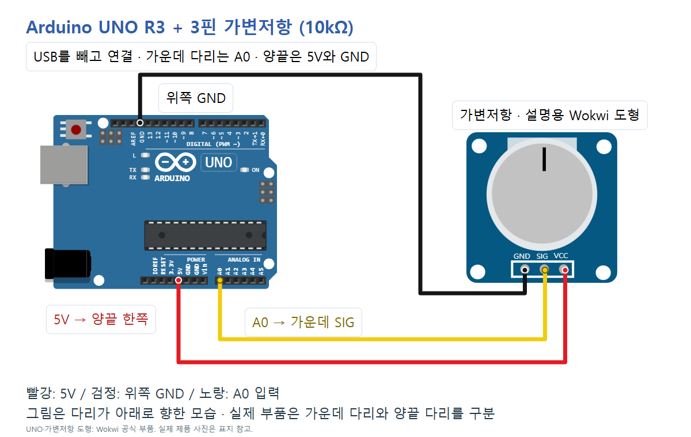
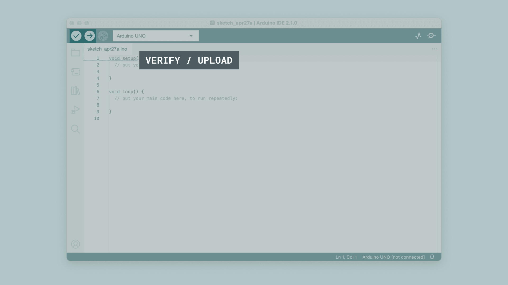

# 손으로 값을 바꾸는 가변저항 · Arduino UNO R3

**3핀 10kΩ 선형 회전 가변저항**(Adafruit 제품번호 562와 같은 단일 접점 부품)을 사용합니다. 양끝의 전체 저항은 10kΩ이고, 손잡이를 돌리면 가운데의 움직이는 접점(wiper)과 양끝 사이 저항이 달라집니다. 양끝에 5V와 GND를 넣으면 가운데 전압이 바뀌므로 A0에서 이를 읽습니다. 각도나 저항값을 직접 측정하는 프로그램은 아닙니다.

## 준비물과 부품 확인

- Arduino UNO R3, USB 데이터 케이블, Arduino IDE
- 3핀 10kΩ 선형 가변저항, 브레드보드, 점퍼선 3개

[Adafruit 제품 페이지](https://www.adafruit.com/product/562)는 10kΩ 선형 제품과 [제조사 P160 자료](https://cdn-shop.adafruit.com/product-files/562/p160.pdf)를 제공합니다. 6핀/스위치 결합형/디지털 가변저항은 이 예제와 다릅니다. 세 다리의 역할을 확인하며 **가운데 다리는 wiper**, 양끝은 고정 저항의 끝입니다. 납땜·다리 방향이 다른 제품은 자체 핀표를 우선합니다.

[가변저항 원리](https://learn.adafruit.com/make-it-change-potentiometers)의 분압 구성을 참고했습니다. 외부 저항은 추가하지 않으며, UNO는 USB로 공급합니다. 10kΩ에 5V를 걸면 이상적인 계산상 전류는 5/10000=0.5mA, 소비 전력은 2.5mW입니다. 이는 실제 측정값이 아닙니다. VIN·외부 배터리를 가변저항에 넣지 않습니다.

## 회로와 연결표

**USB를 빼고 배선**합니다. 세 다리가 서로 다른 브레드보드 연결 줄에 있도록 꽂습니다. 같은 연결 줄에 양끝을 꽂으면 5V와 GND가 이어질 수 있습니다. 가운데 다리를 양끝으로 착각하면 회전 위치에 따라 전원 사이 저항이 아주 작아질 수 있으므로 연결 전 역할을 확인하세요.



| UNO 핀 | 가변저항 다리 | 역할 |
| --- | --- | --- |
| 5V | 양끝 중 한쪽 (그림 VCC) | 전원 |
| 위쪽 GND | 반대쪽 양끝 (그림 GND) | 접지 |
| A0 | 가운데 접점 (그림 SIG) | 입력 전압 |

이 그림은 **디지털 헤더 AREF 옆 GND**를 사용합니다. UNO의 다른 GND도 내부적으로 연결되지만 사진·그림·표·배선 데이터는 위쪽 GND로 통일했습니다. Wokwi에서는 `GND.1`입니다. 양끝 5V·GND를 서로 바꾸면 증가하는 방향이 반대가 되므로 시계 방향 증가라고 단정하지 않습니다. 배선을 바꿀 때도 USB를 뺍니다.

Wokwi의 파란 가변저항 도형은 설명용이며 표지의 실제 맨몸 가변저항 사진과 외형이 다릅니다. 도형에 적힌 VCC/GND/SIG는 각 다리의 **연결 역할**입니다. 실제 제품에 그런 이름이 인쇄돼 있다고 주장하지 않습니다. 예제 `diagram.json`은 공식 UNO/가변저항 부품과 3개 net을 사용합니다. `scale`, `pins`, `previewRoutes`는 로컬 배선 그림의 좌표 검증용 메타데이터입니다. 이 편에서는 시뮬레이션을 실행하지 않았습니다. Wokwi 가변저항은 VCC/GND 미연결 상태도 값을 출력할 수 있다는 [공식 한계 안내](https://docs.wokwi.com/parts/wokwi-potentiometer)가 있으므로 화면의 숫자만으로 실제 전원 배선을 검증할 수 없습니다.

## Arduino IDE에서 실행

Arduino IDE는 코드를 작성하고 UNO로 보내는 프로그램입니다. 아래 참고 화면은 기존 UNO 기본 세팅에서 보존한 **Arduino IDE 2.3.4 실제 실행 화면**이며 **07편 출력이나 실제 가변저항 실험 화면은 아닙니다.** 버전에 따라 메뉴 위치가 다를 수 있습니다.

1. [Arduino 공식 설치 안내](https://www.arduino.cc/en/software)에서 개발 환경을 준비하고 데이터 케이블로 UNO를 연결합니다.
2. 보드를 **Arduino Uno**, 포트를 실제 연결된 COM 포트로 선택합니다. USB를 빼고 다시 꽂았을 때 생기는 포트를 비교합니다. 참고 사진의 COM 번호를 그대로 고르지 않습니다.
   
3. 새 스케치에 아래 코드를 복사·저장하고 확인(컴파일), 업로드(오른쪽 화살표)를 누릅니다. Arduino AVR Boards 1.8.6 기준이며 추가 라이브러리는 필요 없습니다.
   
4. 시리얼 모니터를 열어 **9600 baud**로 맞춥니다.
   

## 전체 코드

```cpp
// UNO R3: outer terminals to 5V/GND; middle wiper to A0.
const byte POT_PIN = A0;
const unsigned long PRINT_MS = 100;

void setup() {
  pinMode(POT_PIN, INPUT);  // Do not enable INPUT_PULLUP.
  Serial.begin(9600);
}

void loop() {
  int raw = analogRead(POT_PIN);
  Serial.print("raw=");
  Serial.println(raw);
  delay(PRINT_MS);
}
```

## 각 줄의 역할

| 줄 | 역할 |
| --- | --- |
| 1 | 양끝 전원·가운데 A0 연결을 설명한 주석 |
| 2 | POT_PIN을 A0로 정함 |
| 3 | PRINT_MS를 100ms로 정함; 출력 간격 조절 가능 |
| 5 | 시작할 때 한 번 실행할 setup 블록 시작 |
| 6 | A0를 입력으로 설정; 내부 풀업을 켜지 않음 |
| 7 | 시리얼 통신을 9600 baud로 시작 |
| 8 | setup 블록 끝 |
| 10 | 반복 실행하는 loop 시작 |
| 11 | A0 전압을 ADC 정수 raw로 읽음 |
| 12 | 값의 이름 raw=를 먼저 출력 |
| 13 | raw 숫자를 출력하고 줄을 바꿈 |
| 14 | 100ms 기다림 |
| 15 | loop 끝; 다시 읽기부터 반복 |

## 관찰과 값의 의미

시리얼에는 `raw=숫자`가 약 100ms 간격으로 반복됩니다. 이 문자열은 코드에서 기대하는 출력이며 실물에서 관찰한 기록이 아닙니다. 손잡이를 한쪽 끝, 가운데, 반대쪽 끝으로 천천히 옮긴 뒤 멈춰 숫자를 비교합니다. 같은 위치에서 값이 조금 흔들릴 수도 있습니다.

[Arduino Analog Input](https://docs.arduino.cc/built-in-examples/analog/AnalogInput/)에서 UNO의 기본 `analogRead()`는 기준 전압에 대한 입력을 0~1023으로 읽습니다. 이 USB·5V 구성에서 가운데 전압이 낮으면 작은 값, 높으면 큰 값이 나옵니다. 보드 공급 전압·오차·접점·노이즈 때문에 끝에서 정확히 0/1023, 물리적 중앙에서 정확히 512를 보장하지 않습니다. 값으로 전압·저항·각도를 환산하지 않았으므로 별도의 가짜 보정값을 넣지 않습니다.

- `PRINT_MS`로 관찰 간격을 바꿀 수 있습니다. 먼저 100ms로 시작합니다.
- 0이나 1023에 고정되면 가운데 다리/A0/양끝을 점검합니다. 예기치 않은 흔들림이 크면 A0 연결이 빠졌는지 확인합니다.
- 글자가 깨지면 시리얼 모니터 9600 baud를 확인합니다. 아무 출력도 없으면 보드·포트·데이터 케이블·업로드 성공을 확인합니다.
- `INPUT_PULLUP`은 기울기 접점 예제와 달리 이 분압 실습에 쓰지 않습니다.
- 이 **UNO 5V 배선**을 ESP32나 Pico의 3.3V GPIO에 그대로 적용하지 않습니다.

## 검증 범위

`python verify.py`로 3개 net, 전원 분리, 공식 UNO/가변저항 핀 중심과 미리보기 선 끝점, A0·입력 모드·출력 간격·코드/README/캡션/사진 일치를 확인합니다. 기본 스킬 검사기는 서보/CDS 템플릿 전용이라 가변저항 검사에 대신 통과했다고 쓰지 않습니다. UNO 컴파일 통과: Arduino AVR Boards 1.8.6, flash 2028B / SRAM 192B. 6장 1080×1350 PNG의 사진 누락·하단 겹침·TECH 블루·모바일, 캡션 복사/저장, 카드 내부 Ctrl+V 이미지 삽입, 전체 PNG ZIP 다운로드는 check.mjs로 통과했습니다. 회로와 전체 카드를 육안으로도 확인했습니다. PowerShell 검수 명령: `$env:PORT="8773"; $env:CODEPLANT_CHECK_EPISODE="arduino-007-potentiometer"; node check.mjs`.

실제 UNO 업로드, 손잡이 방향, ADC 값·전압·저항, 브레드보드 접속은 미시험입니다. 사진·정적 그림·컴파일·편집기 검사를 실물 실행과 구분합니다. Instagram 게시와 게시물별 Manychat DM 연결은 이번 제작 작업에 포함되지 않습니다.

## 출처와 사진 사용 조건

- [Adafruit 3핀 10kΩ 선형 가변저항 제품번호 562](https://www.adafruit.com/product/562) · 2026-10-10 확인
- [가변저항 원리와 가운데 접점](https://learn.adafruit.com/make-it-change-potentiometers) · 2026-10-10 확인
- [제조사 P160 데이터시트 · Adafruit 제공](https://cdn-shop.adafruit.com/product-files/562/p160.pdf) · 2026-10-10 확인
- [Arduino AnalogInput · UNO ADC 범위·분압 배선](https://docs.arduino.cc/built-in-examples/analog/AnalogInput/) · 2026-10-10 확인
- [Wokwi 가변저항·시뮬레이터 한계](https://docs.wokwi.com/parts/wokwi-potentiometer) · 2026-10-10 확인
- [Wokwi 가변저항 공식 핀 좌표](https://github.com/wokwi/wokwi-elements/blob/main/src/potentiometer-element.ts) · 2026-10-10 확인
- [Wokwi UNO 공식 핀 좌표](https://github.com/wokwi/wokwi-elements/blob/main/src/arduino-uno-element.ts) · 2026-10-10 확인
- [UNO R3 사진 · SparkFun CC BY 2.0](https://commons.wikimedia.org/wiki/File:Arduino_Uno_-_R3.jpg) · 2026-10-10 확인
- [실제 가변저항 공식 사진](https://cdn-shop.adafruit.com/970x728/562-03.jpg) · 2026-10-10 확인
- [CODEPLANT 채널 공개 목록 · 해당 부품 영상은 미확정](https://www.youtube.com/@codeplant2024/videos) · 2026-10-10 확인

UNO R3 사진: SparkFun Electronics, CC BY 2.0, 표시 크기만 조절. 가변저항 사진: Adafruit 공식 제품번호 562의 562-03.jpg 원본, 표시 크기만 조절. 제품 사진의 별도 자유 이용 라이선스는 확인하지 못했으며 CC/상업적 재배포 허가를 주장하지 않습니다. 실제 캠페인 이용 조건은 원권리자의 기준을 확인합니다.

기존 CODEPLANT 채널의 공개 페이지를 확인했습니다. 현재 확보한 목록에서 이 3핀 가변저항과 정확히 일치하는 개별 영상을 확정하지 못해 영상의 핀을 추정해 옮기지 않았습니다. 학습 흐름은 기존 센서 편과 같이 개념→부품·배선→코드→값 관찰로 구성하고, 기술 근거는 위 공식 자료를 사용했습니다.
